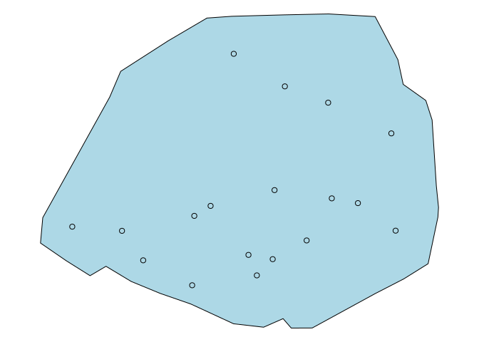
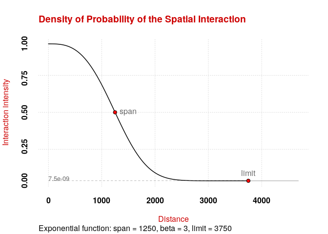
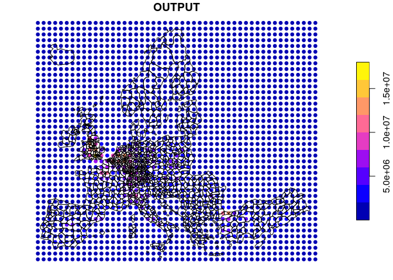
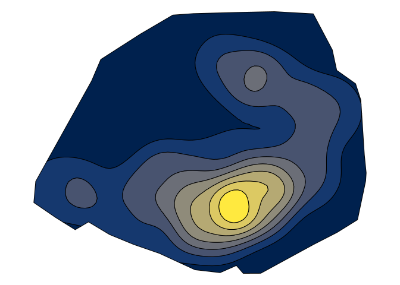

# potential

This package provides functions to compute potential models as defined
by Stewart (1941). Several options are available to customize the
models, such as the possibility to fine-tune the distance friction
functions or to use custom distance matrices. Some computations are
parallelized to improve their efficiency.

## Installation

### From GitHub

Development version / unstable

``` r
require(remotes)
remotes::install_github("riatelab/potential")
```

## Demo

``` r
library(sf)
```

    ## Linking to GEOS 3.7.1, GDAL 3.1.2, PROJ 7.1.0

``` r
library(potential)
data(hospital)

plot(st_geometry(paris), col = "lightblue")
plot(st_geometry(hospital), add = TRUE)
```

<!-- -->

``` r
g <- create_grid(x = paris, res = 150)

plot(st_geometry(paris), col = "lightblue")
plot(st_geometry(hospital), add = TRUE)
plot(st_geometry(g), cex = .2, add = TRUE)
```

<!-- -->

``` r
d <- create_matrix(x = hospital, g)
knitr::kable(d[1:5, 1:5])
```

|     |        1 |        2 |        3 |        4 |        5 |
| :-- | -------: | -------: | -------: | -------: | -------: |
| 208 | 10331.79 | 10246.12 | 10161.94 | 10079.29 |  9998.21 |
| 207 |  6870.45 |  6725.30 |  6580.37 |  6435.68 |  6291.23 |
| 205 | 10578.00 | 10472.13 | 10367.36 | 10263.71 | 10161.21 |
| 204 | 12312.09 | 12181.52 | 12051.40 | 11921.74 | 11792.57 |
| 201 |  3365.12 |  3321.39 |  3283.93 |  3252.97 |  3228.69 |

``` r
probInterPlot(fun = "e", span = 1250, beta = 3)
```

<!-- -->

``` r
pot <- potential(
  x = hospital, y = g,
  d = d, var = "capacity",
  fun = "e", span = 1250,
  beta = 3
)
plot(pot["OUTPUT"], cex = .5, reset = FALSE)
plot(st_geometry(paris), add = TRUE, lwd = 3)
```

<!-- -->

``` r
equipot <- equipotential(pot, mask = paris)
plot(st_geometry(equipot), col = hcl.colors(nrow(equipot), "cividis"))
```

<!-- -->

## Note

This package provides access to the revamped potential-related functions
initialy offered by
[`SpatialPosition`](https://CRAN.R-project.org/package=SpatialPosition).

## References

<div id="refs" class="references">

<div id="ref-STEWART89">

Stewart, John Q. 1941. “An Inverse Distance Variation for Certain Social
Influences.” *Science* 93 (2404): 89–90.
<https://doi.org/10.1126/science.93.2404.89>.

</div>

</div>
