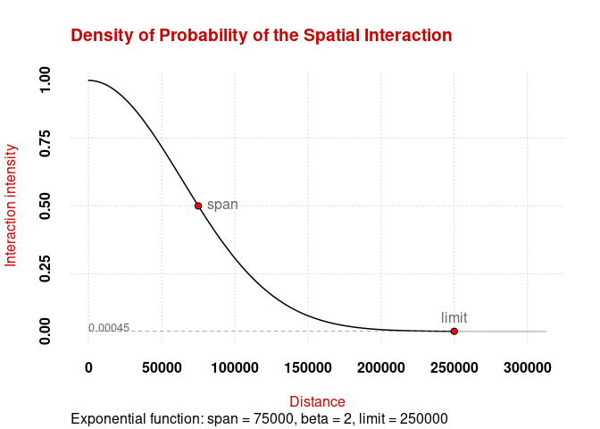
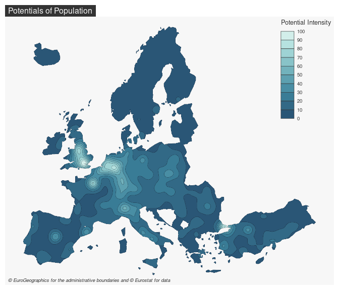

# potential 

[](https://cran.r-project.org/package=potential)
[](https://github.com/riatelab/potential/actions)
[](https://app.codecov.io/gh/riatelab/potential)

This package provides functions to compute the potential model as
defined by Stewart (1941). Several options are available to customize
the model, for example it is possible to fine-tune the distance friction
functions or to use custom distance matrices. Some computations are
parallelized to improve their efficiency.

-   [**Website**](https://riatelab.github.io/potential/)  
-   [**Vignette**](https://riatelab.github.io/potential/articles/potential.html)  
-   [**Blog post**](https://rgeomatic.hypotheses.org/2023)

## Installation

You can install the released version of `potential` from
[CRAN](https://CRAN.R-project.org/package=potential) with:

``` r
install.packages("potential")
```

You can install the development version of `potential` from GitHub with:

``` r
# install.packages("remotes")
remotes::install_github("riatelab/potential")
```

## Demo

``` r
library(mapsf)
library(potential)
# Display the spatial interaction function
plot_inter(fun = "e", span = 75000, beta = 2, limit = 250000)
```

<!-- -->

``` r
# create a regular grid
y <- create_grid(x = n3_poly, res = 20000)
# compute potentials
pot <- mcpotential(
  x = n3_pt, y = y,
  var = "POP19",
  fun = "e", span = 75000,
  beta = 2, limit = 250000, 
  ncl = 2
)
# Define potential according to the maximum value
y$pot <- pot / max(pot) * 100
# create equipotential areas
bks <- seq(0, 100, length.out = 11)
equipot <- equipotential(y, var = "pot", breaks = bks, mask = n3_poly)
# map potentials
mf_theme("default")
mf_map(x = equipot, var = "min", type = "choro", 
       breaks = bks, 
       pal = hcl.colors(10, 'Teal'),
       border = "#121725", 
       leg_val_rnd = 0,
       lwd = .2, 
       leg_pos = "topright", 
       leg_title = "Potential Intensity")
mf_title(txt = "Potentials of Population")
mf_credits(txt = "© EuroGeographics for the administrative boundaries and © Eurostat for data")
```

<!-- -->

## Note

This package provides access to the revamped potential-related functions
initially offered by
[`SpatialPosition`](https://CRAN.R-project.org/package=SpatialPosition).

## References

<div id="refs" class="references csl-bib-body hanging-indent">

<div id="ref-STEWART41" class="csl-entry">

Stewart, John Q. 1941. “An Inverse Distance Variation for Certain Social
Influences.” *Science* 93 (2404): 89–90.
<https://doi.org/10.1126/science.93.2404.89>.

</div>

</div>
